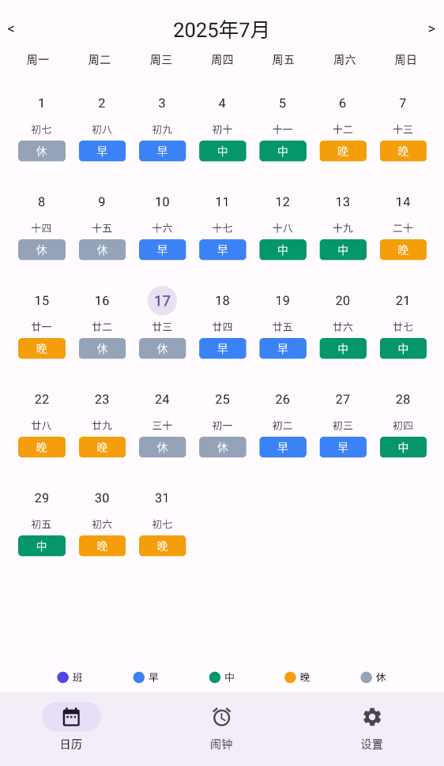
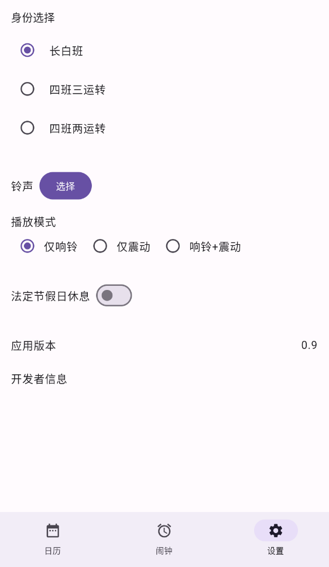

# ⏰ 倒班闹钟

解决倒班人员频繁设置闹钟的烦恼。

 

## ✨ 功能亮点

- 🎯 **精准闹钟**：使用 `setExactAndAllowWhileIdle` 触发毫秒级别的闹钟，支持 Android 13+ 精准闹钟权限。
- 📅 **排班助手**：结合 `ShiftCalculator` 自动为早/中/晚班生成闹钟。
- 🏖 **节假日同步**：`HolidaySyncWorker` 定时拉取节假日数据，自动关闭节假日的闹钟。
- 🔔 **可定制铃声**：支持本地音乐与闹钟振动模式。

<table>
 <tr><td align="center">📱</td><td>小巧 · 专注离线 · 无广告 · 隐私友好</td></tr>
</table>

## 📸 界面预览

| 闹钟列表 | 排班日历 | 设置 |
| --- | --- | --- |
|  |  |  |

---

## 🚀 快速开始

```bash
# 克隆项目
$ git clone https://github.com/your-name/alarm_clock.git
$ cd alarm_clock

# 使用 Android Studio
#  File → Open → 选择项目根目录

# 或命令行构建并安装到已连接设备
$ ./gradlew installDebug
```

### 先决条件

- **Android Studio Hedgehog** 或以上版本（自带 JDK 17）
- Android SDK 33+
- Gradle Wrapper（已包含）

---

## 🛠️ 项目结构

```
.                            # 仓库根目录
├── app/                     # Android 应用模块
│   ├── build.gradle.kts     # 模块级 Gradle 脚本
│   └── src/
│       ├── main/            # 生产代码
│       │   ├── AndroidManifest.xml
│       │   ├── java/com/example/alarm_clock_2/
│       │   │   ├── alarm/      # 闹钟调度、Service、Receiver
│       │   │   ├── data/       # Room Entity、DAO、Repository
│       │   │   ├── shift/      # 排班算法
│       │   │   ├── ui/         # Jetpack Compose 界面层
│       │   │   ├── worker/     # WorkManager 后台任务
│       │   │   ├── di/         # Hilt 依赖注入模块
│       │   │   └── util/       # 通用工具类
│       │   └── res/            # 资源文件 (drawable、layout、values...)
│       ├── androidTest/        # 仪器测试 (Espresso / Compose UI Test)
│       └── test/               # JVM 单元测试
├── doc/                       # 设计文档与发布指南
├── gradle/                    # Gradle Wrapper 与版本锁定文件
├── build.gradle.kts           # 根级 Gradle 脚本
├── gradle.properties          # 构建配置属性
└── settings.gradle.kts        # 模块与插件声明
```

详细设计请见 [`doc/`](doc/index.html)。

---

## 🤝 贡献指南

1. 🍴 Fork 本仓库并创建分支：`git checkout -b feature/awesome`。
2. 🧪 编写 / 更新测试：`./gradlew test`。
3. 📝 遵循 [Kotlin 官方代码风格](https://kotlinlang.org/docs/coding-conventions.html)（建议安装 *ktlint*）。
4. 🔨 提交前运行 `./gradlew spotlessApply` 进行格式化。
5. 🚀 发起 Pull Request，并说明变更动机。

### Commit 信息

- 使用 [Conventional Commits](https://www.conventionalcommits.org/)⚙️：`feat: 新增XXXX功能`、`fix: 修复XXXX`。

### Issue 指南

- 请用简洁标题描述问题。
- 提供 **复现步骤**、**预期行为**、**实际行为** 及日志截图。

---

## 📜 行为准则

本项目遵循 [Contributor Covenant](https://www.contributor-covenant.org/) v2.1。请大家互相尊重、友好沟通，一起让社区更美好 ✨。

---

## 📄 许可证

```
Apache License 2.0
```

> © 2024 Alarm Clock Authors. Released under the Apache-2.0 License. 