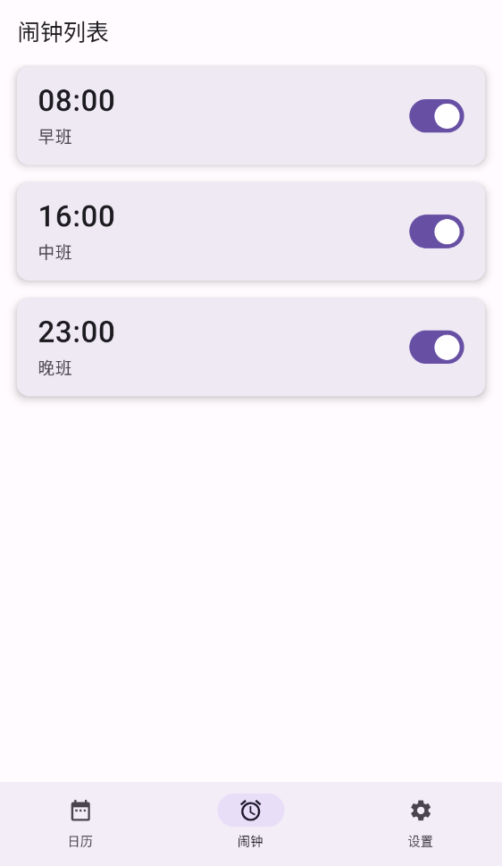
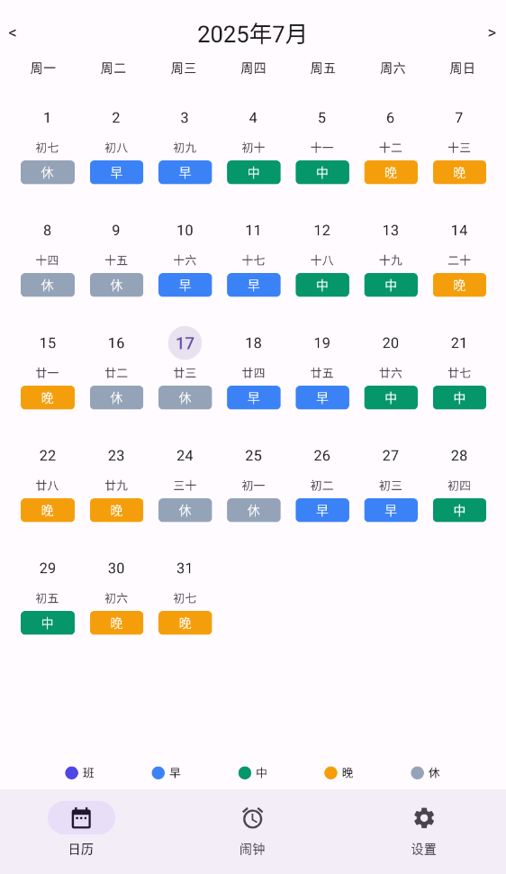
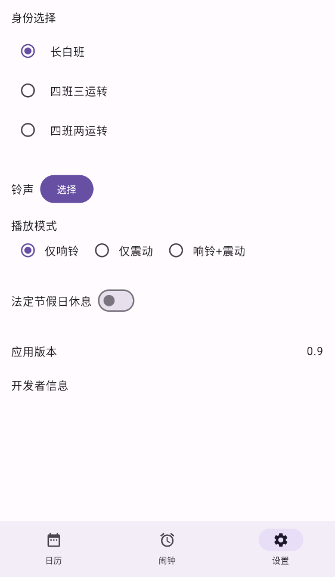

# ⏰ 倒班闹钟

解决倒班人员频繁设置闹钟的烦恼。

   

## ✨ 功能亮点

- 🎯 **精准闹钟**：使用 `setExactAndAllowWhileIdle` 触发毫秒级别的闹钟，支持 Android 13+ 精准闹钟权限。
- 📅 **排班助手**：结合 `ShiftCalculator` 自动为早/中/晚班生成闹钟。
- 🏖 **节假日同步**：`HolidaySyncWorker` 定时拉取节假日数据，自动关闭节假日的闹钟。
- 🔔 **可定制铃声**：支持本地音乐与闹钟振动模式。
- 🏗️ **现代架构**：采用 Clean Architecture + MVVM + UseCase 模式，代码可维护性极高。
- 🧪 **高质量代码**：统一错误处理、完善的输入验证、类型安全的数据流。

<table>
 <tr><td align="center">📱</td><td>小巧 · 专注离线 · 无广告 · 隐私友好</td></tr>
 <tr><td align="center">🏗️</td><td>Clean Architecture · 高可维护性 · 现代化技术栈</td></tr>
</table>

## 📸 界面预览

| 闹钟列表 | 排班日历 | 设置 |
| --- | --- | --- |
|  |  |  |

---

## 🚀 快速开始

### 📱 用户使用
1. 下载最新版本APK
2. 安装并授予必要权限（精准闹钟、通知）
3. 选择您的排班类型（长白班/四三班/四二班）
4. 系统自动生成对应班次的闹钟
5. 享受智能排班闹钟服务！

### 👨‍💻 开发者构建

```bash
# 克隆项目
$ git clone https://github.com/your-name/alarm_clock.git
$ cd alarm_clock

# 使用 Android Studio (推荐)
#  File → Open → 选择项目根目录
#  等待Gradle同步完成
#  点击运行按钮或 Shift+F10

# 或命令行构建
$ ./gradlew assembleDebug          # 构建APK
$ ./gradlew installDebug           # 安装到已连接设备
```

### 📋 先决条件

- **Android Studio Hedgehog (2023.1.1)** 或以上版本
- **JDK 17+** (Android Studio自带)
- **Android SDK 34+** (目标API 34)
- **Gradle 8.11+** (Wrapper已包含)
- **Kotlin 2.0.21+** (支持Compose编译器插件)

### 🔧 项目配置
项目使用现代化的Gradle配置：
- **Kotlin DSL** (.gradle.kts)
- **版本目录** (libs.versions.toml)
- **Compose编译器插件** (Kotlin 2.0+)
- **类型安全的依赖管理**

---

## 🛠️ 项目结构

### 📁 整体架构

本项目采用 **Clean Architecture** 设计，分层清晰，职责明确：

```
.                            # 仓库根目录
├── app/                     # Android 应用模块
│   ├── build.gradle.kts     # 模块级 Gradle 脚本
│   └── src/
│       ├── main/            # 生产代码
│       │   ├── AndroidManifest.xml
│       │   ├── java/com/example/alarm_clock_2/
│       │   │   ├── alarm/         # 闹钟调度、Service、Receiver
│       │   │   ├── data/          # 数据层 (Entity、DAO、Repository)
│       │   │   │   └── model/     # UI数据模型
│       │   │   ├── domain/        # 领域层 (UseCase业务逻辑)
│       │   │   │   └── usecase/   # 业务用例
│       │   │   ├── shift/         # 排班算法
│       │   │   ├── ui/            # 表现层 (ViewModel、Compose UI)
│       │   │   │   └── components/ # 可复用UI组件
│       │   │   ├── worker/        # WorkManager 后台任务
│       │   │   ├── di/            # Hilt 依赖注入模块
│       │   │   └── util/          # 通用工具类 (常量、Result封装)
│       │   └── res/               # 资源文件 (drawable、layout、values...)
│       ├── androidTest/           # 仪器测试 (Espresso / Compose UI Test)
│       └── test/                  # JVM 单元测试
├── doc/                          # 设计文档与发布指南
├── gradle/                       # Gradle Wrapper 与版本锁定文件
├── build.gradle.kts              # 根级 Gradle 脚本
├── gradle.properties             # 构建配置属性
├── settings.gradle.kts           # 模块与插件声明
└── COMPREHENSIVE_REFACTORING_REPORT.md  # 重构报告
```

### 🏗️ 架构层次

#### 1. **表现层 (Presentation Layer)**
- **UI组件**: 基于 Jetpack Compose 的现代化UI
- **ViewModel**: 管理UI状态，处理用户交互
- **可复用组件**: AlarmCard、EmptyState、AlarmEditBottomSheet等

#### 2. **领域层 (Domain Layer)**
- **UseCase**: 封装业务逻辑，提高可测试性
  - `AlarmUseCase`: 闹钟CRUD操作
  - `AlarmScheduleUseCase`: 调度相关业务逻辑
- **数据模型**: AlarmDisplayItem、ShiftOption等

#### 3. **数据层 (Data Layer)**
- **Repository**: 数据访问抽象，支持多数据源
- **DAO**: Room数据库访问对象
- **Entity**: 数据库实体定义

#### 4. **基础设施层 (Infrastructure Layer)**
- **依赖注入**: Hilt模块配置
- **工具类**: 常量管理、Result封装、错误处理

详细设计请见 [`doc/`](doc/index.html) 和 [重构报告](COMPREHENSIVE_REFACTORING_REPORT.md)。

---

## 🚀 技术栈

### 核心技术
- **Kotlin 2.0.21**: 现代化编程语言，100% Kotlin代码
- **Jetpack Compose**: 声明式UI框架，Material Design 3
- **Clean Architecture**: 分层架构，职责分离
- **MVVM + UseCase**: 表现层模式 + 业务逻辑封装

### 依赖注入 & 数据
- **Hilt**: Google推荐的依赖注入框架
- **Room**: 类型安全的SQLite抽象层
- **DataStore**: 现代化的数据持久化方案
- **Flow**: 响应式数据流

### 异步 & 后台
- **Coroutines**: Kotlin协程，优雅的异步编程
- **WorkManager**: 可靠的后台任务调度
- **AlarmManager**: 系统级精准闹钟

### 质量保证
- **Result封装**: 统一的错误处理机制
- **类型安全**: 利用Kotlin类型系统防止运行时错误
- **输入验证**: 完善的数据验证和边界检查

---

## 🤝 贡献指南

### 开发环境设置
1. 🍴 Fork 本仓库并创建分支：`git checkout -b feature/awesome`
2. 📱 确保Android Studio版本 >= Hedgehog (2023.1.1)
3. ☕ JDK 17+ (Android Studio自带)
4. 🔧 启用Kotlin 2.0编译器插件

### 代码规范
1. 📝 遵循 [Kotlin 官方代码风格](https://kotlinlang.org/docs/coding-conventions.html)
2. 🏗️ 遵循Clean Architecture原则：
   - UI逻辑放在Compose组件中
   - 业务逻辑封装在UseCase中
   - 数据访问通过Repository抽象
3. 🛡️ 使用Result类进行错误处理
4. 📊 新增功能需要相应的单元测试

### 构建和测试
```bash
# 编译检查
./gradlew compileDebugKotlin

# 构建APK
./gradlew assembleDebug

# 运行单元测试（如果有）
./gradlew testDebugUnitTest

# 安装到设备
./gradlew installDebug
```

### 提交流程
1. 🧪 确保代码编译通过：`./gradlew assembleDebug`
2. 🔍 检查代码质量，遵循项目架构模式
3. 📝 使用 [Conventional Commits](https://www.conventionalcommits.org/)：
   - `feat: 新增XXXX功能`
   - `fix: 修复XXXX问题`
   - `refactor: 重构XXXX模块`
   - `docs: 更新文档`
4. 🚀 发起 Pull Request，详细说明变更动机和实现方案

### Issue 指南
- 🎯 使用简洁明确的标题
- 📋 提供完整信息：
  - **复现步骤**
  - **预期行为**
  - **实际行为**
  - **设备信息** (Android版本、机型)
  - **日志截图** (如适用)
- 🏷️ 添加适当的标签 (bug/enhancement/question)

---

## 📜 行为准则

本项目遵循 [Contributor Covenant](https://www.contributor-covenant.org/) v2.1。请大家互相尊重、友好沟通，一起让社区更美好 ✨。

---

## 📄 许可证

```
Apache License 2.0
```

> © 2024 Alarm Clock Authors. Released under the Apache-2.0 License. 