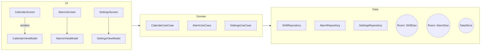
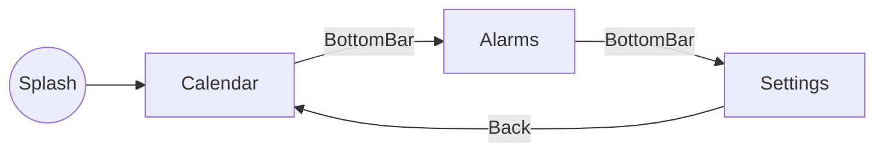
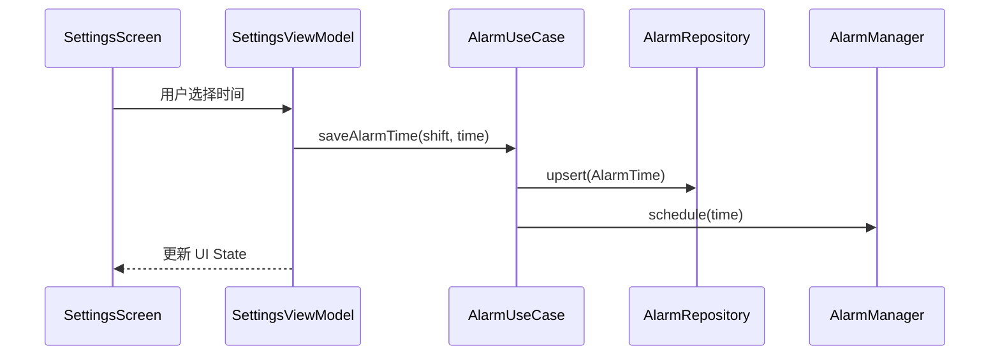
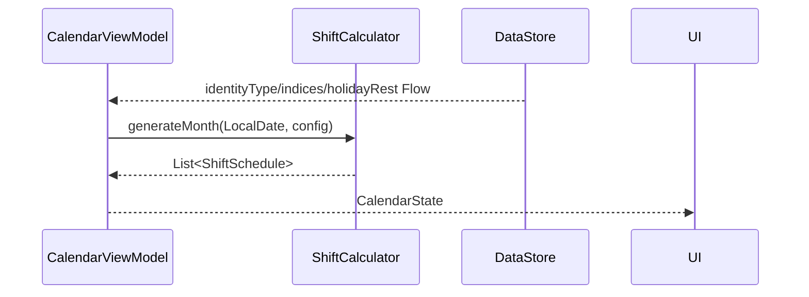

# 倒班闹钟安卓应用设计文档

## 1. 目的
本文档基于《需求文档》与 `index.html` 原型，详细说明 Android 端实现方案，作为产品、设计、研发、测试之间的沟通契约。

## 2. 范围
适用于 **倒班闹钟** Android 应用 V1.0 的设计与实现，后续版本若有重大改动需更新本文档。

## 3. 术语
| 缩写 | 含义 |
|------|------|
| MVVM | Model-View-ViewModel 架构模式 |
| DAO  | Data Access Object，数据访问层 |
| UI   | User Interface，用户界面 |
| SP   | SharedPreferences，本地键值对存储 |
| RTC  | Real-Time Clock，硬件时钟 |

## 4. 总体设计概述
### 4.1 技术栈
* **Kotlin** 1.9
* **Android SDK** 34 (最小兼容 24)
* **Jetpack Compose**：声明式 UI
* **Architecture Components**：ViewModel / LiveData / Navigation / DataStore
* **AlarmManager + PendingIntent**：系统闹钟
* **WorkManager**：后台任务与重试策略（如节假日数据刷新）
* **Room**：持久化班次与闹钟配置

### 4.2 架构模式
采用 **Clean Architecture + MVVM** 以分离关注点，层次及依赖方向如下：



### 4.3 模块划分
| Module | 主要职责 |
|--------|-----------|
| **ui** | Compose 视图层，含三大页面及组件 |
| **presentation** | ViewModel、状态管理、导航 |
| **domain** | 用例 (UseCase) 层，封装业务逻辑 |
| **data** | Repository、Room、DataStore、Alarm Scheduler |
| **di** | Hilt 依赖注入配置 |

### 4.4 主要第三方库
* Hilt（`com.google.dagger:hilt-android`）
* Accompanist（Pager、Permissions）
* kotlinx-datetime（日期计算）
* Tencent Lunar （农历转换，可替换 web 版 solarlunar）

## 5. 功能设计
### 5.1 用户身份选择
* 入口：`SettingsScreen > 身份选择` 单选卡片
* 数据：`IdentityType` 枚举 (`DAY`, `FOUR_THREE`, `FOUR_TWO`)
* UI 变化：切换后立即刷新日历与闹钟列表
* 持久化：写入 `DataStore.identity_type`

### 5.2 闹钟时间设置
* UI：`AlarmList` 行内 `TimeTextField` + Switch
* 数据模型：
  ```kotlin
  data class AlarmTime(
      val shift: ShiftType,
      val time: LocalTime,
      val enabled: Boolean = true
  )
  ```
* 保存在 `AlarmRepository`; 更新时立即调用 `AlarmScheduler` 重建系统闹钟

### 5.3 班次周期配置
* 四班三运转：今日班次 + 明日班次；计算 8 天循环起点
* 四班两运转：今日班次；计算 4 天循环起点
* 算法：在 `ShiftCalculator` 中实现，可单元测试

### 5.4 法定节假日管理
* 节假日数据来源：内置 JSON + GitHub Action 定期同步国家日历 API
* 偏好项：`holidayRest: Boolean`
* 当 `holidayRest == true` && `isLegalHoliday(date)` 时，日历班次强制显示 **休**，同时闹钟不响

### 5.5 日历视图显示
* 组件：`LazyVerticalGrid` + 自定义 `CalendarCell`
* 支持滑动或 Picker 选择月份
* 数据流：`CalendarViewModel` 监听 `identityType`, `cycleStartIndex`, `holidayRest` -> 生成月份状态

### 5.6 闹钟管理与系统集成
* 使用 `AlarmManager.setExactAndAllowWhileIdle()` 注册下一次激活
* `AlarmReceiver` 触发后展示全屏闹钟 Activity
* 兼容重启：`BootCompletedReceiver` 重建所有启用闹钟
* 关闭闹钟：`AlarmScheduler.cancel(id)`

### 5.7 数据持久化
| 数据 | 存储方式 |
|------|-----------|
| 身份类型、节假日开关 | `DataStore` Preferences |
| 班次起点索引 | `DataStore` |
| 闹钟时间列表 | `Room.AlarmDao` |

### 5.8 用户界面导航
使用 `Navigation-Compose` + BottomBar


## 6. 数据模型
```kotlin
enum class ShiftType { DAY_SHIFT, EARLY, MIDDLE, LATE, OFF }

data class ShiftSchedule(
    val date: LocalDate,
    val type: ShiftType
)
```
更多模型详见 `domain.model` 包。

## 7. 关键交互流程
### 7.1 保存闹钟时间


### 7.2 日历渲染


## 8. UI 设计对照
| 原型页面 (`index.html`) | Android 对应页面 | 关键组件 |
|------------------------|------------------|----------|
| Calendar 视图          | `CalendarScreen` | `LazyGrid`, `MonthHeader` |
| Alarms 视图            | `AlarmsScreen`   | `LazyColumn`, `Switch`, `TimeField` |
| Settings 视图          | `SettingsScreen` | `Card`, `RadioButton`, `TimePickerDialog` |

## 9. 权限与声明
| 权限 | 说明 |
|------|------|
| `SCHEDULE_EXACT_ALARM` | Android 12+ 精确闹钟 |
| `RECEIVE_BOOT_COMPLETED` | 设备重启后重建闹钟 |
| `WAKE_LOCK` | 响铃时保持 CPU 唤醒 |

## 10. 错误处理
* 无法设置精确闹钟：引导用户到系统设置授予权限
* Room 操作异常：降级为内存缓存并 Toast 提示

## 11. 性能 & 能耗
* 仅在闹钟更新或 0 点计算次日班次时运行后台任务
* 使用 `WorkManager` 约束在充电 + 非低电量时刷新节假日数据

## 12. 安全性
* 数据仅存本地，无敏感权限
* Proguard 开启，防止反编译

## 13. 测试策略
| 类型 | 工具 | 覆盖点 |
|------|------|--------|
| 单元测试 | JUnit5 + Turbine | 班次算法、闹钟调度 |
| UI 测试 | Compose Test | Tab 切换、TimePicker、权限流程 |
| 集成测试 | Robolectric | DataStore + ViewModel |

## 14. CI/CD
* GitHub Actions: PR -> Lint + Unit Test -> Release 生成 `apk` Artifact
* 后续可接入 Firebase App Distribution

---
> **作者**：YourNameHere  
> **最后更新**：${new Date().toISOString().split('T')[0]} 